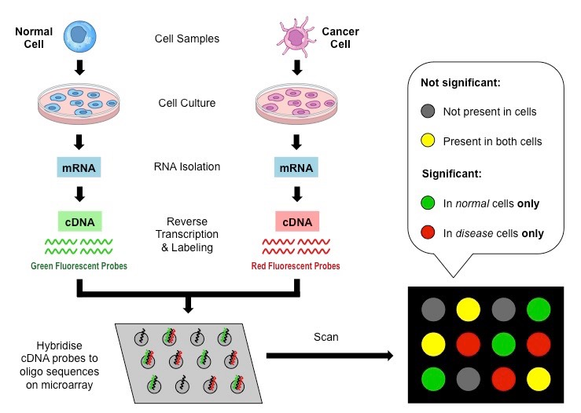

# Feature Selection in Microarrays

## Asbtract

The advent of DNA Microarray technology has enabled researchers to analyze gene expression levels simultaneously. Microarray experiments have applications in various healthcare areas such as disease prediction and detection, oncology, etc. Thus, Microarray classification poses many challenges for data analysis since a gene expression dataset may consist of dozens of observations with thousands or even tens of thousands of genes. Thus, Microarray data analysis is the process of finding the most informative genes as well as removing redundant and irrelevant genes. However, due to the high dimensionality of Microarray data, classification of gene expression profiles is a challenging task. One of the most effective solutions to address this problem is to apply feature selection (dimensionality reduction technique) prior to classification. In the context of DNA microarrays, this means identifying those genes whose expression is most closely related to the task at hand, whether it is classifying samples into different groups or predicting a clinical outcome. The aim of this paper is to review recent feature selection techniques applied to DNA microarrays.

## Introduction

Microarray technology is a powerful tool that has helped researchers measure the level of gene expression. In microarray analysis it has been a useful tool for solving various gene expression profiling problems.

Microarray analysis has been used to identify biomarkers for diagnosis, prognosis, and disease monitoring. A DNA microarray study demonstrated that gene expression patterns in breast cancer biopsy samples correlate with patient survival [Perou et al., 2000](#perou2000). Another study used protein microarrays to identify biomarkers in the serum of patients with Alzheimer's disease [Ray et al., 2007](#ray2007classification).

Microarray analysis has also been used to detect genetic variants, including mutations, deletions, and insertions. A DNA microarray study demonstrated that genetic variants can affect response to anticoagulant drugs [Gage et al., 2004](#gage2004use). Another study used DNA microarrays to identify genetic variants in patients with polycystic kidney disease [Kugita et al., 2011](#kugita2011global).

Several studies have shown that many of the genes in microarray datasets are irrelevant or insignificant in the diagnosis of different diseases. Therefore, incorrect diagnoses can be reached when all genes are used in microarray gene expression classification. There are two main problems related to microarray data analysis. First, the dataset is high-dimensional, meaning it is composed of thousands of genes, and it has low data dispersion, meaning there is a limited number of samples, usually dozens. Second, gene expression data exhibits high complexity; genes are directly or indirectly correlated with each other.

To address these problems, feature selection is one of the most widely used techniques that allow removing redundant and irrelevant features in microarray datasets. The application of this technique has the effect of increasing the accuracy performance of classification algorithms. Dimensionality reduction can be achieved in many ways. Feature selection methods are classified into four approaches: filters, wrapper, and embedding.

The filter method involves each feature being evaluated individually by using its general statistical properties. On the other hand, the wrapper method uses learning techniques to select the optimal feature subset. While the embedded method searches for the optimal feature subset and is embedded in the classifier; the search space is combined into the hypothesis space.

The rest of the paper has been organized into four sections as follows. Section two presents the theoretical background to explain Microarray technology. Section three reviews the literature describing the development of feature selection methods on gene expression datasets. Section four presents a review of feature selection methods from 2019. Finally, section five presents conclusions on the work done.

## Context

This section describes the basics of microarray technology and microarray data analysis.

Stephen Fodor and colleagues at the Affymax Research Institute in 1991 presented a seminal study [Fodor et al., 1991](#fodor1991light) that demonstrated that DNA could be made into microarrays. This article describes the development of a new technology for oligonucleotide synthesis using mask photolithography, a process that uses precisely directed beams of light to target chemical reactions to specific spots. This allowed for miniaturization because spot density is limited only by light diffraction.

Patrick Brown and colleagues at Stanford University in 1995 published groundbreaking work [Schena et al., 1995](#schena1995quantitative) with a technology that allowed measurement of gene expression of thousands of genes simultaneously in a single sample, revolutionizing research in molecular biology and genomics. Brown and colleagues used a microarray of complementary DNA (cDNA) from Arabidopsis 45 to which they hybridized fluorescently labeled cellular messenger RNA (mRNA). The intensity of the fluorescence at a spot reflected the amount of hybridized mRNA, which in turn reflected the level of that particular mRNA in the initial sample. This approach allowed researchers to measure the expression of thousands of genes simultaneously and determine which genes were active and which were not under different experimental conditions. It also allowed the identification of gene expression patterns that correlated with different physiological or pathological states, leading to new discoveries in molecular biology and genetics.

DNA microarrays can be used for a wide variety of applications, such as detecting genetic mutations, identifying genes involved in disease, characterizing gene expression profiles, investigating gene regulation, and identifying single nucleotide polymorphisms (SNPs) associated with complex diseases.

A DNA microarray, also known as a DNA chip or biochip, is a solid surface to which a collection of DNA fragments are attached. Scientists use DNA microarrays to measure the expression levels of hundreds of genes or to analyze numerous parts of a gene's genotype.

## Related Works

Feature selection problems are NP-complex. Therefore, several intelligent optimization frameworks have been proposed in the literature to select an optimal subset with much lower computational cost. Feature selection or gene selections have been used to deal with the problem of high dimensionality of features in Microarray datasets.

In gene expression Microarray data analysis, feature selection techniques are typically used to find the informative genes. Feature selection is how differentially expressed genes are discovered. The feature selection process is also called gene prioritization or biomarker discovery. The process of analyzing Microarray data is a challenging task as ultimately there are too few samples which in turn have too many features. The sparsity of microarray data exists due to the process of experiments. Feature selection techniques can be broadly classified into the following classes: *filter*, *wrapper*, *ensemble*, and *hybrid*.

### Filter Approach
In the filter approach, each feature is evaluated individually by using its general statistical properties. The filter approach does not use any specific learning model. Therefore, it is independent of the classifier. In this approach, typical features (genes) were classified using specific criteria, while then the features with the highest scores were selected. After this, these features are used as input for the classifier or wrapper methods.

### Wrapper Approach
The concept of wrapper approach involves the use of learning techniques to select the optimal feature subset. The model hypothesis is combined with the classifier in the search space to arrive at a more accurate classification result. The wrapper approach usually requires high computational costs, along with a higher risk of overfitting, while it then shows better performance than the filter approach. In relation to the analysis of Microarrays wrapper approach may employ metaheuristic methods. These metaheuristic methods can be:

**Genetic Algorithm (GA)**. GA is a heuristic process inspired by natural selection and the theory of biological evolution. The algorithm is composed of three selection operations, namely (1) natural selection, (2) crossover, and (3) mutation. The main objective of GA is to simulate the survival of the fittest from each individual selection in a population. The search space contains a number of individual genes that are combined to form a chromosome. The chromosome comprises solutions that solve the problems before the genes are transferred to the next generation. Within the selection operation, the fittest individuals are chosen and consequently, in crossover selection, two individuals are chosen based on their fitness score. From the crossover operation, offspring are created by swapping between the two individual genes until a random crossover point is achieved. New offspring will be produced iteratively in the population after swapping the gene between the individual crossover. However, some of the new offspring are created with high or low random bits depending on the mutation operation. Mutation is important to maintain difference within the population and avoid immature convergence.

**Particle Swarm Optimization (PSO)**. PSO is a population-based optimization algorithm inspired by natural behavior (bird swarms, fish schools, and ant colonies) [Kennedy et al., 1995](#kennedy1995particle). The main objective of PSO is to search for the optimal solution through the stochastic and deterministic elements of particle trajectories. These particles are also known as agents, which will randomly move to improve the best solution in a population of particle solutions. The particle solution then moves through the search space according to the algorithm settings, including the particle's position and velocity. The particle can be identified as agent search (xbest) and group search (gbest). Each particle will search for the best position in the search space, and the particle's position will be continuously updated and searched by other particles. The particle will change its position based on the new velocity substituted by xbest, gbest and other parameter settings, namely inertial weight, two positive constant values ​​and two random parameter threshold values ​​(0~1). To motivate searching for the possible location, the inertial weight is typically defined with a higher initial value and a lower final value before the initial particles are randomly distributed. The implementation of PSO is relatively easy and simple compared to other optimization methods because the parameters are easily tuned and robust.

**Harmony Search Algorithm (HSA)**. HSA was first introduced by [Geem et al., 2001](#geem2001new) as a metaheuristic algorithm. HSA is a metaheuristic optimization algorithm that mimics the musical state of harmony. The goal of HSA is to emulate the perfect sound of harmony in music by finding the possible combination of musical pitch signals and storing the values ​​in harmony memory (HM). The HM process is slightly similar to the GA based on population and swarm intelligence. There are three components in HSA, namely (1) initialization, (2) improvisation, and (3) update. In the first step, the HM is initialized, where the number of solutions to the optimization problem is randomly generated. In the second step, each solution is improvised and obtained based on the harmony memory consideration ratio (HMCR). The HMCR can be defined as the probability of selecting a solution that comes from the HM elements. Finally, in the third step, the HM updates the best fitness value from the second step by replacing and removing the worst solution from the HM elements.

**Ant Colony Optimization (ACO)**. ACO was introduced in 1996 by Dorigo, Maniezzo, and Colorni. ACO is a metaheuristic optimization that mimics the nature of ant species and their foraging behavior [Dorigo et al., 1996](#dorigo1996ant). ACO was invented based on the ants' criterion to find the shortest path to a food source near the colony. Thus, the goal of ACO is to search for the best path in a weighted graph; i.e., the node or edge components of the path to the food source. Then, ants will randomly search for any food source near their colony. The food quality is later evaluated when ants encounter a food source. Ants will return to the colony and leave pheromones or markers along the path to guide other ants to follow the same path to the food source. Therefore, based on a certain probability, other ants will subsequently follow the same path, where the pheromone marks will remain and become stronger on the same path. The pheromone trace on the path will be strong due to the increasing number of ants following that path.

**Artificial Bee Colony Optimization (ABC)**. ABC is a swarm-based optimization algorithm invented by [Karaboga et al., 2005](#karaboga2005idea). Similar to ACO, ABC mimics the foraging behavior of bees. A group of bees productively performing social assistance tasks is called a swarm. In the group, there are three different roles of bees, namely (1) worker bees, (2) spectator bees, and (3) scout bees. All these bees are considered as the number of solutions in the swarm. Worker bees will first find a good food source and share the information about the food source with spectator bees. The information collected from worker bees will later be used by spectator bees to select the high-quality (fitness) food source and differentiate it from the lower-quality ones. Scout bees produced by some employed bees will leave their food sources to find a new food source.

**Firefly Algorithm (FA)**. FA is a bio-inspired optimization algorithm introduced by [Yang et al., 2009](#yang2009firefly) FA mimics the behavior of fireflies and is inspired by their brightness tendencies towards each other. Each firefly attracts each other using its brightness intensity. In FA, there are three steps, namely (1) attractiveness, (2) randomization, and (3) absorption. Like other optimization concepts, the search for the optimal solution or fitness occurs in FA. In the first step (attractiveness), fireflies attract each other. In the second step, high brightness intensity affects the connection between fireflies. Fireflies emitting lower brightness move towards fireflies with strong light. Fireflies with strong and bright light will move randomly. Finally, the brightness of fireflies is absorbed or determined by the component of the objective function.

**Cuckoo Search Algorithm (CS)**. CS is a bio-inspired optimization algorithm inspired by the reproductive component of cuckoo birds to increase the population [Gandomi et al., 2013](#gandomi2013cuckoo). The goal of CS is to lay new eggs and select the best solution (cuckoo egg) to change the bad solution in the nest. In this case, the swarm solution is the egg and the nest. In the basic concept, cuckoos usually place their eggs in the nests of other cuckoos, hoping that their offspring will be raised by the surrogate parents. There are cases when some of the eggs do not belong to the cuckoo. Then, the eggs with the best quality and the best nests will be passed on to the next pairs. Finally, the host nest is selected by discovering the egg laid by the cuckoo with a certain probability value. In this case, the host bird can build a new nest and lay new eggs, abandon the nest, or throw away the eggs. These eggs are called strange eggs. Strange eggs are discarded from the nest or all eggs in the nest are abandoned.

**Gravitational Search Algorithm (GSA)**. GSA was first introduced by [Rashedi et al., 2009](#rashedi2009gsa). GSA is an optimization algorithm based on Newton's law and mass interactions. In this algorithm, the population of individuals (known as masses) and their performances are presented using their masses. GSA follows Newton's law where all mass attracts each other. Individuals with good solutions have heavy masses and move slower than lighter masses (bad solutions).

**Gray Wolf Optimization (GWO)**. GWO is a bio-inspired optimization algorithm based on gray wolves hunting prey in mutual cooperation. The GWO algorithm was introduced by Mirjalili et al. (2014) to simulate the mechanism and behavior of gray wolves through the hunting and attacking process [Mirjalili et al., 2014](#mirjalili2014grey). There are three steps of the GWO algorithm, namely (1) surrounding, (2) hunting, and (3) attacking. When the gray wolves have decided the location of the prey, they start surrounding it. After surrounding their prey, based on the setting of certain parameters in the GWO algorithm, the gray wolves hunt the prey and continue to update their new distance to the prey and their new positions. Finally, the gray wolves start hunting for the catch and the results are published. The gray wolves finish the hunt by attacking the prey until the prey stops moving.

**Whale Optimization Algorithm (WOA)**. WOA is a recently introduced bio-inspired metaheuristic optimization method based on the hunting mechanism of humpback whales. The WOA algorithm was developed by [Mirjalili and Lewis., 2016](#mirjalili2016whale). This algorithm is inspired by the bubble-net feeding mechanism of humpback whales. The strategy contains three basic hunting steps: circling the prey, searching for the prey, and attacking the target.

### Ensemble Approach

In the Embedded approach, the feature selection process is integrated into the learning or model building phase. It is less computationally expensive than the wrapper method and less prone to overfitting.

### Hybrid Approach.

The hybrid approach is designed to take advantage of both the filter and wrapper approaches. Thus, it combines the computational efficiency of the filter approach with the high performance of the wrapper approach. It is based on two stages; the first is to reduce the dimension of the feature space. Next, the wrapper method is applied to select the optimal feature subset. However, the hybrid model may be less accurate because the filter and wrapper are performed in different steps.

In the context of Microarrays and feature selection, various approaches have been applied. For example, [Tabakhi et al., 2015](#tabakhi2015relevance) proposed an ant colony optimization algorithm, incorporated with a filter method for gene selection to minimize gene redundancies.

[Alshamlan et al., 2015](#alshamlan2015genetic) proposed a hybrid method combining genetic algorithm (GA) and artificial bee colony (ABC). The proposed algorithm is applied to a gene expression profile of microarrays to select the most predictive and informative genes for cancer classification.

[Elyasigomari et al., 2015](#elyasigomari2015cancer) proposed a hybrid method combining a cuckoo optimization algorithm (COA) and genetic algorithm (GA), which selected the significant genes in cancer classification by shuffling. For gene classification, Support Vector Machines (SVM) and Multilayer Perceptron (MLP) were used.

[Medjaheda et al., 2017](#medjahed2017kernel) proposed an approach for cancer diagnosis through kernel-based learning and feature selection. In the first phase, support vector machines based on recursive feature elimination (SVM-RFE) were used to eliminate 40 percent of the features. The remaining subset was processed through Binary Dragonfly (BDF) to retain only informative genes.

[Lu et al., 2017"](#lu2017hybrid) proposed MIMAGA, a hybrid feature selection algorithm that combines mutual information maximization (MIM) and adaptive genetic algorithm (AGA). Initially, MIM was applied as a preprocessing step to obtain a subset containing only 300 genes. Then the wrapper technique, AGA, was applied.

# References

-  **Perou, Charles M., S{\o}rlie, Therese, Eisen, Michael B., Van De Rijn, Matt, Jeffrey, Stefanie S., Rees, Christian A., Pollack, Jonathan R., Ross, Douglas T., Johnsen, Hilde, Akslen, Lars A., et al.** *Molecular portraits of human breast tumours*. Nature, vol. 406, no. 6797, pp. 747-752, 2000. Nature Publishing Group UK London.
-  **Ray, Sandip, Britschgi, Markus, Herbert, Charles, Takeda-Uchimura, Yoshiko, Boxer, Adam, Blennow, Kaj, Friedman, Leah F., Galasko, Douglas R., Jutel, Marek, Karydas, Anna, et al.** *Classification and prediction of clinical Alzheimer's diagnosis based on plasma signaling proteins*. Nature Medicine, vol. 13, no. 11, pp. 1359-1362, 2007. Nature Publishing Group US New York.
-  **Gage, Brian F., Eby, Charles, Milligan, Paul E., Banet, Gerald A., Duncan, Jill R., McLeod, Howard L.** *Use of pharmacogenetics and clinical factors to predict the maintenance dose of warfarin*. Thrombosis and Haemostasis, vol. 91, no. 01, pp. 87-94, 2004. Schattauer GmbH.
-  **Kugita, Masanori, Nishii, Kazuhiro, Morita, Miwa, Yoshihara, Daisuke, Kowa-Sugiyama, Hiroe, Yamada, Kouji, Yamaguchi, Tamio, Wallace, Darren P., Calvet, James P., Kurahashi, Hiroki, et al.** *Global gene expression profiling in early-stage polycystic kidney disease in the Han: SPRD Cy rat identifies a role for RXR signaling*. American Journal of Physiology-Renal Physiology, vol. 300, no. 1, pp. F177–F188, 2011. American Physiological Society Bethesda, MD.
-  **Fodor, Stephen P. A., Read, J. Leighton, Pirrung, Michael C., Stryer, Lubert, Lu, Amy Tsai, Solas, Dennis.** *Light-directed, spatially addressable parallel chemical synthesis*. Science, vol. 251, no. 4995, pp. 767-773, 1991. American Association for the Advancement of Science.
-  **Schena, Mark, Shalon, Dari, Davis, Ronald W., Brown, Patrick O.** *Quantitative monitoring of gene expression patterns with a complementary DNA microarray*. Science, vol. 270, no. 5235, pp. 467-470, 1995. American Association for the Advancement of Science.
-  **Kennedy, James, and Russell Eberhart**. *Particle swarm optimization*. Proceedings of ICNN'95 - International Conference on Neural Networks, vol. 4, IEEE, 1995, pp. 1942-1948.
-   **Geem, Zong Woo, Joong Hoon Kim, and Gobichettipalayam Vasudevan Loganathan**. *A new heuristic optimization algorithm: harmony search*. Simulation, vol. 76, no. 2, Sage Publications, 2001, pp. 60-68.
-  **Dorigo, Marco, Vittorio Maniezzo, and Alberto Colorni**. *Ant system: optimization by a colony of cooperating agents*. IEEE Transactions on Systems, Man, and Cybernetics, Part B (Cybernetics), vol. 26, no. 1, IEEE, 1996, pp. 29-41.
-  **Karaboga, Dervis, et al**. *An idea based on honey bee swarm for numerical optimization*. Technical report-tr06, Erciyes University, Engineering Faculty, Computer Science, 2005.
-  **Yang, Xin-She**. *Firefly algorithms for multimodal optimization*. Stochastic Algorithms: Foundations and Applications: 5th International Symposium, SAGA 2009, Sapporo, Japan, October 26-28, 2009. Proceedings 5, Springer, 2009, pp. 169-178.
-  **Gandomi, Amir Hossein, Xin-She Yang, and Amir Hossein Alavi**. *Cuckoo search algorithm: a metaheuristic approach to solve structural optimization problems*. Engineering with Computers, vol. 29, Springer, 2013, pp. 17-35.
-  **Rashedi, Esmat, Hossein Nezamabadi-Pour, and Saeid Saryazdi**. *GSA: a gravitational search algorithm*. Information Sciences, vol. 179, no. 13, Elsevier, 2009, pp. 2232-2248.
-  **Mirjalili, Seyedali, Seyed Mohammad Mirjalili, and Andrew Lewis**. *Grey wolf optimizer*. Advances in Engineering Software, vol. 69, Elsevier, 2014, pp. 46-61.
-  **Mirjalili, Seyedali, and Andrew Lewis**. *The whale optimization algorithm*. Advances in Engineering Software, vol. 95, Elsevier, 2016, pp. 51-67.
-  **Tabakhi, Sina, and Parham Moradi**. *Relevance--redundancy feature selection based on ant colony optimization*. Pattern Recognition, vol. 48, no. 9, Elsevier, 2015, pp. 2798-2811.
-  **Alshamlan, Hala M., Ghada H. Badr, and Yousef A. Alohali**. *Genetic Bee Colony (GBC) algorithm: A new gene selection method for microarray cancer classification*. Computational Biology and Chemistry, vol. 56, Elsevier, 2015, pp. 49-60.
-  **Elyasigomari, Vahid, MS Mirjafari, Hazel RC Screen, and M Hasan Shaheed**. *Cancer classification using a novel gene selection approach by means of shuffling based on data clustering with optimization*. Applied Soft Computing, vol. 35, Elsevier, 2015, pp. 43-51.
-  **Medjahed, Seyyid Ahmed, Tamazouzt Ait Saadi, Abdelkader Benyettou, and Mohammed Ouali**. *Kernel-based learning and feature selection analysis for cancer diagnosis*. Applied Soft Computing, vol. 51, Elsevier, 2017, pp. 39-48.
-   **Lu, Huijuan, Junying Chen, Ke Yan, Qun Jin, Yu Xue, and Zhigang Gao**. *A hybrid feature selection algorithm for gene expression data classification*. Neurocomputing, vol. 256, Elsevier, 2017, pp. 56-62.
